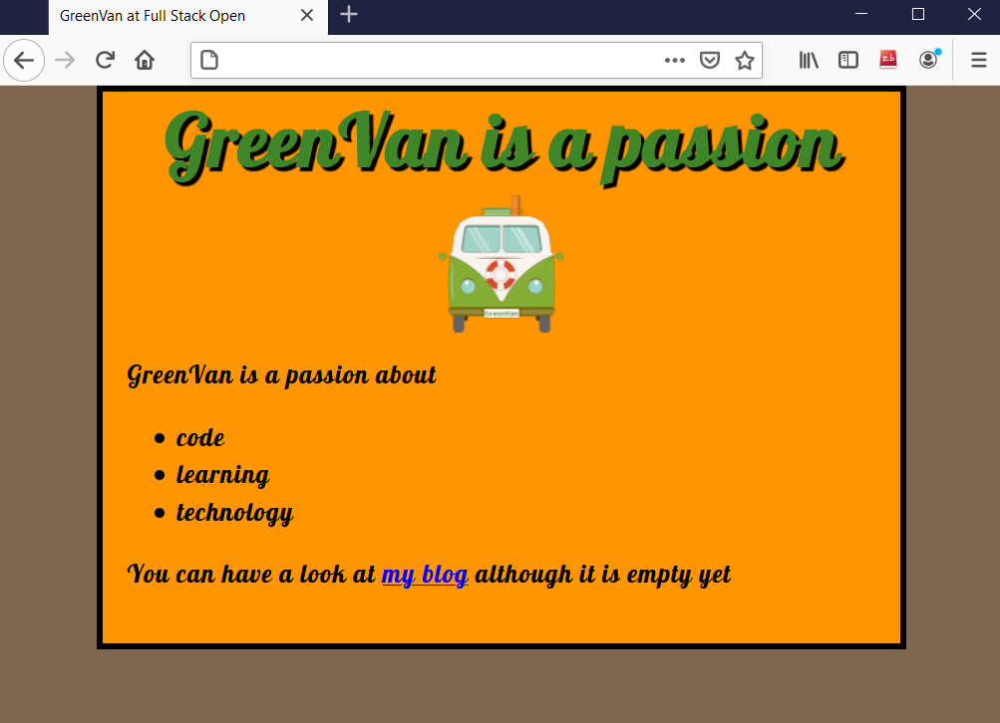

# Exercise 0.2: CSS
Review the basics of CSS by reading this tutorial from Mozilla: [CSS tutorial](https://developer.mozilla.org/en-US/docs/Learn/Getting_started_with_the_web/CSS_basics).

My CSS solution: [index.html](index.html) and [style.css](css/style.css)

Screenshot:

