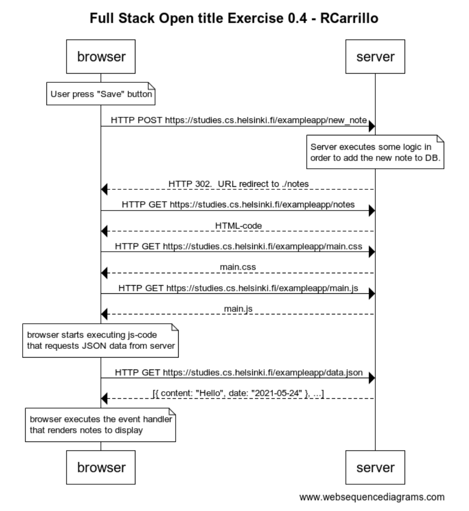

# Exercise 0.4: new note
Create a diagram depicting the situation where the user creates a new note on page https://studies.cs.helsinki.fi/exampleapp/notes by writing something into the text field and clicking the submit button.



Here is the code for the diagram using the [websequencediagrams](https://www.websequencediagrams.com) service
```
title Full Stack Open title Exercise 0.4 - RCarrillo

note over browser:
User press "Save" button
end note
browser->server: HTTP POST https://studies.cs.helsinki.fi/exampleapp/new_note
note over server:
Server executes some logic in 
order to add the new note to DB.
end note
server-->browser: HTTP 302.  URL redirect to ./notes
browser->server: HTTP GET https://studies.cs.helsinki.fi/exampleapp/notes
server-->browser: HTML-code
browser->server: HTTP GET https://studies.cs.helsinki.fi/exampleapp/main.css
server-->browser: main.css
browser->server: HTTP GET https://studies.cs.helsinki.fi/exampleapp/main.js
server-->browser: main.js

note over browser:
browser starts executing js-code
that requests JSON data from server 
end note

browser->server: HTTP GET https://studies.cs.helsinki.fi/exampleapp/data.json
server-->browser: [{ content: "Hello", date: "2021-05-24" }, ...]

note over browser:
browser executes the event handler
that renders notes to display
end note

```

