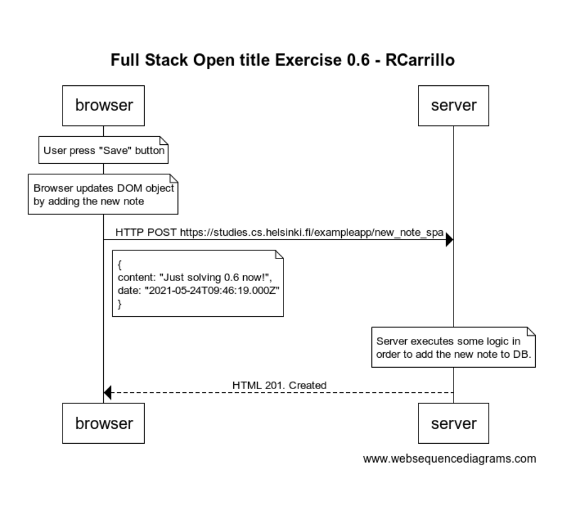

# Exercise 0.6: New note
Create a diagram depicting the situation where the user creates a new note using the single page version of the app.



Here is the code for the diagram using the [websequencediagrams](https://www.websequencediagrams.com) service
```
title Full Stack Open title Exercise 0.6 - RCarrillo

note over browser:
User press "Save" button
end note
note over browser:
Browser updates DOM object 
by adding the new note 
end note


browser->server: HTTP POST https://studies.cs.helsinki.fi/exampleapp/new_note_spa
note right of browser
{
  content: "Just solving 0.6 now!",
  date: "2021-05-24T09:46:19.000Z"
}
end note
note over server
Server executes some logic in 
order to add the new note to DB.
end note

server-->browser: HTML 201. Created

```

