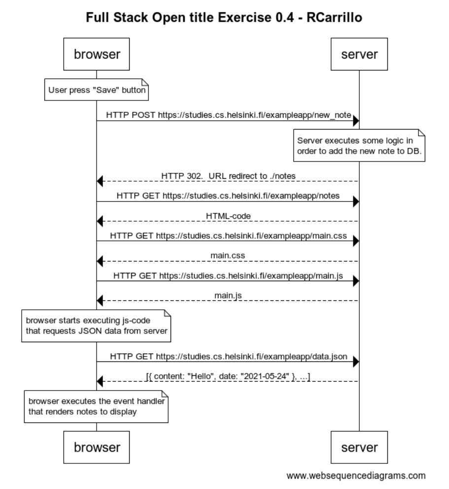

# Part 0: Fundamentals of Web apps
Full Stack Course at th University of Helsinky (2021)

This is a compilation of the exercises.
The diagrams have been created using the [websequencediagrams](https://www.websequencediagrams.com) service

## 0.4: new note
Create a diagram depicting the situation where the user creates a new note on page https://studies.cs.helsinki.fi/exampleapp/notes by writing something into the text field and clicking the submit button.

**[(View full code)](0.4/README.md)**

## 0.5: Single page app
Create a diagram depicting the situation where the user goes to the single page app version of the notes app at https://studies.cs.helsinki.fi/exampleapp/spa.

**[(View full code)](0.5/README.md)**

## 0.6: New note
Create a diagram depicting the situation where the user creates a new note using the single page version of the app.

**[(View full code)](0.6/README.md)**
