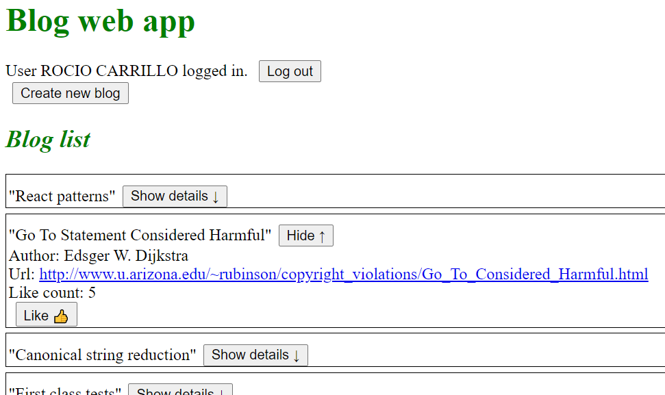

# Part 5: Testing React apps
**Full Stack Course at th University of Helsinky (2021)**

This is a compilation of the exercises of Part 5.

- [Exercise 5.1: Blog list frontend, step1](#exercise-51--blog-list-frontend--step1)
- [Exercise 5.2: Blog list frontend, step2](#exercise-52--blog-list-frontend--step2)
- [Exercise 5.3 Bloglist frontend, step3](#exercise-53-bloglist-frontend--step3)
- [Exercise 5.4 bloglist frontend, step4](#exercise-54-bloglist-frontend--step4)
- [Exercise 5.5 Bloglist frontend, step5](#exercise-55-bloglist-frontend--step5)
- [Exercise 5.6 Bloglist frontend, step6](#exercise-56-bloglist-frontend--step6)
- [Exercise 5.7 Bloglist frontend, step7](#exercise-57-bloglist-frontend--step7)
- [Exercise 5.8 Bloglist frontend, step8](#exercise-58-bloglist-frontend--step8)
- [Exercise 5.9 Bloglist frontend, step9](#exercise-59-bloglist-frontend--step9)
- [Exercise 5.10 Blog list frontend, step10](#exercise-510-blog-list-frontend--step10)
- [Exercise 5.11 Blog list frontend, step11](#exercise-511-blog-list-frontend--step11)
- [Exercise 5.12 Blog list frontend, step12](#exercise-512-blog-list-frontend--step12)
- [Exercise 5.13 Blog list tests, step1](#exercise-513-blog-list-tests--step1)
- [Exercise 5.14 Blog list tests, step2](#exercise-514-blog-list-tests--step2)
- [Exercise 5.15 Blog list tests, step3](#exercise-515-blog-list-tests--step3)
- [Exercise 5.16 Blog list tests, step4](#exercise-516-blog-list-tests--step4)
- [Exercise 5.17 bloglist end to end testing, step1](#exercise-517-bloglist-end-to-end-testing--step1)
- [Exercise 5.18 bloglist end to end testing, step2](#exercise-518-bloglist-end-to-end-testing--step2)
- [Exercise 5.19 bloglist end to end testing, step3](#exercise-519-bloglist-end-to-end-testing--step3)
- [Exercise 5.20 bloglist end to end testing, step4](#exercise-520-bloglist-end-to-end-testing--step4)
- [Exercise 5.21 bloglist end to end testing, step5](#exercise-521-bloglist-end-to-end-testing--step5)
- [Exercise 5.22 bloglist end to end testing, step6](#exercise-522-bloglist-end-to-end-testing--step6)


## Exercise 5.1: Blog list frontend, step1
1. Clone the application from Github with the command: 

    ```bash 
    git clone https://github.com/fullstack-hy/bloglist-frontend
    ``` 

2. Remove the git configuration of the cloned application (dir .git)
3. Install dependencies: `npm install`
4. Start application: `npm start`

5. Implement login functionality to the frontend. The token returned with a successful login is saved to the application's state user. If a user is not logged-in, only the login form is visible. If user is logged-in, the name of the user and a list of blogs is shown. User details of the logged-in user do not have to be saved to the local storage yet.

  5.1 Add some components in order to do the page prettier: `components/Footer.js`, `components/Header.js` and `index.css`.
  5.2 Add `components/Notification.js` in order to show errors and other notifications in the future.
  5.3 Add `services/login.js` as suggested:
    ```js
    import axios from 'axios'
    const baseUrl = '/api/login'

    const login = async credentials => {
      const response = await axios.post(baseUrl, credentials)
      return response.data
    }

    const loginService = { login }
    export default loginService
    ``` 
  5.4 Modify `App.js`:
    - state handling of username, password and user.
    - handleLogin function
    - Conditional return


```js
    
const App = () => {
  const [blogs, setBlogs] = useState([])

  
  const [errorMessage, setErrorMessage] = useState(null)

  const [username, setUsername] = useState('') 
  const [password, setPassword] = useState('') 
  const [user, setUser] = useState(null)

  useEffect(() => {
    blogService.getAll().then(blogs =>
      setBlogs( blogs )
    )  
  }, [])


  const handleLogin = async (event) => {
    event.preventDefault()
    try {
      const user = await loginService.login({
        username, password,
      })
      setUser(user)
      setUsername('')
      setPassword('')
    } catch (exception) {
      setErrorMessage('Wrong credentials')
      setTimeout(() => {
        setErrorMessage(null)
      }, 5000)
    }
  }


  if (user === null) {
    return (
      <div>
      <Header />      
      <Notification message={errorMessage} />
        <h2>Log in to application</h2>
        <form onSubmit={handleLogin}>
        <div>
          Username <input
            type="text"
            value={username}
            name="Username"
            onChange={({ target }) => setUsername(target.value)}
          />
        </div>
        <div>
          Password <input
            type="password"
            value={password}
            name="Password"
            onChange={({ target }) => setPassword(target.value)}
          />
        </div>
        <button type="submit">login</button>
      </form>
      </div>
    )
  }

  return (
    <div>
      <Header />
      <h2>Blog list</h2>
      {blogs.map(blog =>
        <Blog key={blog.id} blog={blog} />
      )}
      <Footer/>
    </div>
  )
}
```

## Exercise 5.2: Blog list frontend, step2
Make the login 'permanent' by using the local storage and implement a way to log out.

In the `handlelogin` function we store in the value `loggedBlogappUser` in local storage :
```js
      window.localStorage.setItem(
        'loggedBlogappUser', JSON.stringify(user)
      )
```

The application checks if user details of a logged-in user can already be found on the local storage using an effect hook:
```js
  useEffect(() => {
    const loggedUserJSON = window.localStorage.getItem('loggedBlogappUser')
    if (loggedUserJSON) {
      const user = JSON.parse(loggedUserJSON)
      setUser(user)
    }
  }, [])
```

Created the `handlelogout` function:
```js
  const handleLogout =  (event) => {
    event.preventDefault()

    window.localStorage.removeItem('loggedBlogappUser')
    setUser(null)
  }
```

Added this line before bloglist to show user and the logout button:
```html
 <div>User {user.name} logged in. <button onClick={handleLogout}>Log out</button></div>

```

At this point, some refactoring has been done: 
1. Created BlogList Component
2. Created LoginForm Component

The `return` statement in `App.js` :

```js
if (user === null) {
    return (
      <div>
        <Header />
        <Notification message={errorMessage} />
        <LoginForm
          handleLogin={handleLogin}
          username={username}
          password={password}
          onChangeUsernameHandler={({ target }) => setUsername(target.value)}
          onChangePasswordHandler={({ target }) => setPassword(target.value)}/>
      </div>
    )
  }

  return (
    <div>
      <Header />
      <div>User {user.name} logged in. <button onClick={handleLogout}>Log out</button></div>
      <BlogList blogs={blogs}/>
      <Footer/>
    </div>
  )
}
```

## Exercise 5.3 Bloglist frontend, step3
Expand your application to allow a logged-in user to add new blogs

1. Add `setToken` and `create` to `services\blogs.js`:

  ```js
  let token = null

  const setToken = newToken => {
    token = `bearer ${newToken}`
  }

  const create = async newObject => {
    const config = {
      headers: { Authorization: token }
    }

    const response = await axios.post(baseUrl, newObject, config)
    return response.data
  }
  ```

2. Set token at `handleLogin()` in `App.js`:

  ```js
  blogService.setToken(user.token)
  ```
3. Create `components/NewBlogForm.js` with the new component.
  ```js
  import React from 'react'
  
  const NewBlogForm = ({ onSubmitHandler, title, handleTitleChange, author, handleAuthorChange, url, handleUrlChange }) => (
    <div><h2>Create new</h2>
      <form onSubmit={onSubmitHandler}>
        <ul>
          <li>
            <label htmlFor="title">Title:</label>

            <input
              value={title}
              onChange={handleTitleChange}
            />
          </li>
          <li>
            <label htmlFor="author">Author:</label>
            <input
              value={author}
              onChange={handleAuthorChange}
            />
          </li>
          <li>
            <label htmlFor="url">url:</label>
            <input
              value={url}
              onChange={handleUrlChange}
            />
          </li>
          <li className="button">
            <button type="submit">Create</button>
          </li>
        </ul>
      </form>
    </div>
  )

  export default NewBlogForm
  ```

4. Add Field component to `App.js` under the return statement.
  ```html
        <NewBlogForm
        onSubmitHandler={addBlog}
        title={newBlogTitle}
        handleTitleChange={handleTitleChange}
        author={newBlogAuthor}
        handleAuthorChange={handleAuthorChange}
        url={newBlogUrl}
        handleUrlChange={handleUrlChange}
      />
  ```
5. Added state for input fields and handlers in `App.js`:
  ```js
  [...]
  const [newBlogTitle, setNewBlogTitle] = useState('')
  const [newBlogAuthor, setNewBlogAuthor] = useState('')
  const [newBlogUrl, setNewBlogUrl] = useState('')
  [...]
  
  const addBlog = (event) => {
    event.preventDefault()
    const blogObject = {
      title: newBlogTitle,
      author: newBlogAuthor,
      url: newBlogUrl
    }

    blogService
      .create(blogObject)
      .then(returnedBlog => {
        setBlogs(blogs.concat(returnedBlog))
        setNewBlogTitle('')
        setNewBlogAuthor('')
        setNewBlogUrl('')
      })
  }

  const handleTitleChange = (event) => {
    setNewBlogTitle(event.target.value)
  }
  const handleAuthorChange = (event) => {
    setNewBlogAuthor(event.target.value)
  }
  const handleUrlChange = (event) => {
    setNewBlogUrl(event.target.value)
  }
  ```

6. Added some css styles in `index.css` in order to make the forms more attractive.


At this point the app does add a new Blog if no validation error occurs. User is not informed about successful and unsuccessful operations.

## Exercise 5.4 bloglist frontend, step4
Implement notifications which inform the user about successful and unsuccessful operations at the top of the page. 

1. In `App.js`, instead of "errorMessage" we will use "notification" for a more general purpose. It will contain the message and the type of notification (error or notification)
  ```js
  const [notification, setNotification] = useState(null)
  ```
2. Created notifyWith method in `App.js`
  ```js
  const notifyWith = (message, type = 'notification') => {
    setNotification({ message, type })
    setTimeout(() => {
      setNotification(null)
    }, 5000)
  }
  ```
3. In `handleLogin` and `addBlog` methods we add a try catch block to capture error and display it:
  ```js
  catch (error) {
    notifyWith(`Error: ${error.response.data.error}`, 'error')
  }
  ```
4. In `addBlog` we add also a notification after the blog is created. Await syntax has replace the .then() syntax used before.
  ```js
      try {
      const returnedBlog = await blogService.create(blogObject)
      setBlogs(blogs.concat(returnedBlog))
      setNewBlogTitle('')
      setNewBlogAuthor('')
      setNewBlogUrl('')
      notifyWith(`Added new blog: "${returnedBlog.title}" (by ${returnedBlog.author})`, 'notification')
    } catch (error) {
      notifyWith(`Unable to create new Blog. Error: ${error.response.data.error}`, 'error')
    }
  ```
5. Also in `App.js`: `Notification` component has been added after the `Header` under the return clause in both cases: when user is logged in and when is not.
  ```xml
    <Notification notification={notification}/>
  ```
6. `components/Notification.js` has been changed in order to support error and notification cases:
  ```js
  const Notification = ({ notification }) => {
    if (notification === null) {
      return null
    }

    return (
      <div className={notification.type}>
        {notification.message}
      </div>
    )
  }
  export default Notification
  ```
7. CSS styles have been added to `index.css`:
  ```css
    .error {
    color: red;
    background: lightgrey;
    width: 500px;
    font-size: 20px;
    border-style: solid;
    border-radius: 5px;
    padding: 10px;
    margin-bottom: 10px;
  }
    
  .notification {
    color: green;
    background: lightgrey;
    width: 500px;
    font-size: 20px;
    border-style: solid;
    border-radius: 5px;
    padding: 10px;
    margin-bottom: 10px;
  }
  ```

  
## Exercise 5.5 Bloglist frontend, step5
Change the form for creating blog posts so that it is only displayed when appropriate. 
- By default the form is not visible.
- The form closes when a new blog is created.


1. Create `Toggable.js` as shown in the [course material](https://fullstackopen.com/en/part5/props_children_and_proptypes#displaying-the-login-form-only-when-appropriate).
2. Wrap the new blog form component inside the Togglable component.
  ```xml 
      <Togglable buttonLabel="Create new blog">
        <NewBlogForm
          onSubmitHandler={addBlog}
          title={newBlogTitle}
          handleTitleChange={handleTitleChange}
          author={newBlogAuthor}
          handleAuthorChange={handleAuthorChange}
          url={newBlogUrl}
          handleUrlChange={handleUrlChange}
        />
      </Togglable>
  ```
3. Create reference to newBlogForm:
  ```js
  import React, { useState, useEffect, useRef } from 'react'

  const App = () => {
  // ...
  const newBlogFormRef = useRef()
  //...
    <Togglable buttonLabel="Create new blog" ref={newBlogFormRef}>
    //...
    </Togglable>
  )
  ```

4. Change the Togglable component as shown in the course material:

  ```js
  import React, { useState, useImperativeHandle } from 'react'

  const Togglable = React.forwardRef((props, ref) => {
    const [visible, setVisible] = useState(false)

    const hideWhenVisible = { display: visible ? 'none' : '' }
    const showWhenVisible = { display: visible ? '' : 'none' }

    const toggleVisibility = () => {
      setVisible(!visible)
    }

    useImperativeHandle(ref, () => {
      return {
        toggleVisibility
      }
    })

    return (
      <div>
        <div style={hideWhenVisible}>
          <button onClick={toggleVisibility}>{props.buttonLabel}</button>
        </div>
        <div style={showWhenVisible}>
          {props.children}
          <button onClick={toggleVisibility}>cancel</button>
        </div>
      </div>
    )
  })

  export default Togglable
  ```

5. Hide the form by calling newBlogFormRef.current.toggleVisibility() after a new blog is created.
  ```js
    newBlogFormRef.current.toggleVisibility()
  ```

## Exercise 5.6 Bloglist frontend, step6
Separate the form for creating a new blog into its own component, and move all the states required for creating a new blog to this component.
The component must work like the NoteForm component from the [material](https://fullstackopen.com/en/part5/props_children_and_proptypes) of this part.
1. Modify `NewBlogForm.js` to include all this state part:
```js 
const NewBlogForm = ({
  createNewBlog
}) => {
  const [title, setTitle] = useState('')
  const [author, setAuthor] = useState('')
  const [url, setUrl] = useState('')

  const handleTitleChange = (event) => {
    setTitle(event.target.value)
  }
  const handleAuthorChange = (event) => {
    setAuthor(event.target.value)
  }
  const handleUrlChange = (event) => {
    setUrl(event.target.value)
  }

  const addBlog = async (event) => {
    event.preventDefault()
    createNewBlog({
      title: title,
      author: author,
      url: url
    })
    setTitle('')
    setAuthor('')
    setUrl('')
  }
  ```

  2. Simplify at App.js:
  ```js
    const addBlog = async (blogObject) => {
    try {
      const returnedBlog = await blogService.create(blogObject)
      setBlogs(blogs.concat(returnedBlog))
      notifyWith(`Added new blog: "${returnedBlog.title}" (by ${returnedBlog.author})`, 'notification')
    } catch (error) {
      notifyWith(`Unable to create new Blog. Error: ${error.response.data.error}`, 'error')
    }
    newBlogFormRef.current.toggleVisibility()
  }

  //...
  
        <NewBlogForm createNewBlog={addBlog} />
  ```

## Exercise 5.7 Bloglist frontend, step7
Add a button to each blog, which controls whether all of the details about the blog are shown or not.
1. Add inline styles
  ```js
  const Blog = ({ blog }) => {
  const blogStyle = {
    paddingTop: 10,
    paddingLeft: 2,
    border: 'solid',
    borderWidth: 1,
    marginBottom: 5
  }

  return (
    <div style={blogStyle}>
      //...
    </div>
  )
  }
  ```
2. Add state for visibility of the Blog
  ```js
  const [blogVisible, setBlogVisible] = useState(false)
  const showWhenVisible = { display: blogVisible ? '' : 'none' }
  ```
3. Add a button to change state. Showing an arrow and the message "show" or "hide" depending on that state. Information is shown if `blogVisible` is set to true:
  ```js
  return (
    <div style={blogStyle}>
      <div>
    &quot;{blog.title}&quot;

        <button onClick={() => setBlogVisible(!blogVisible)}>
          { blogVisible ? 'Hide \u2191' : 'Show details \u2193' }
        </button>

        <div style={showWhenVisible}>
          Author: {blog.author} <br />
          Url: <a href={blog.url}>{blog.url}</a> <br/>
          Like count: {blog.likes}  <br/>
          <button>Like &#128077; </button>
        </div>
      </div>
    </div>
  )
  ```
  Like button does nothing at this point.

  



## Exercise 5.8 Bloglist frontend, step8
Implement the functionality for the like button. 
1. Add update function to `services/blogs.js`:
  ```js
  const update = async (id, newObject) => {
    const response = await axios.put(`${baseUrl}/${id}`, newObject)
    return response.data
  }
  ```
2. Add increaseLikes handler and elevate to their parents Blog and BlogList in order to be defined in `App.js`

  ```js 
  const Blog = ({ blog, updateBlog }) => { 

    //...

  const increaseLikes = async (event) => {
    blog.likes++
    updateBlog(blog)
  }

  return (
  //...
    <button onClick={increaseLikes}>Like &#128077; </button>
  //...
  )
  }

  const BlogList = ({ blogs, updateBlog }) => (
   <div>
     <h2>Blog list</h2>
     {blogs.map(blog =>
       <Blog key={blog.id} blog={blog} updateBlog={updateBlog}/>
     )}
   </div>
  ) 
  ```
3. In `App.js` create `updateBlog` method:
  ```js
    const updateBlog = async (blogObject) => {
    const blogToUpdate = {
      title: blogObject.title,
      author: blogObject.author,
      url: blogObject.url,
      likes: blogObject.likes
    }

    if (blogObject.user != null) blogToUpdate.user = blogObject.user.id
    console.log(blogToUpdate)
    try {
      const returnedBlog = await blogService.update(blogObject.id, blogToUpdate)
      // Actualizar en el estado de la lista de Blogs el blog actualizado
      setBlogs(blogs.map(blog => blog.id === blogObject.id ? blogObject : blog))
      console.log(`Updated: "${returnedBlog.title} (by ${returnedBlog.author})`)
    } catch (error) {
      notifyWith(`Unable to update Blog. Error: ${error.response.data.error}`, 'error')
    }
  }
  ```
   Pass it to the `BlogList` component:
   ```xml   
      <BlogList blogs={blogs} updateBlog={updateBlog}/>
   ```

## Exercise 5.9 Bloglist frontend, step9
Modify the application to list the blog posts by the number of likes.
Each time setBlogs is called, blog list is sorted using `sortingByLikes` that orders decreasingly by the number of likes:
```js
  const sortingByLikes = (a, b) => (b.likes - a.likes)
  //...
  setBlogs(blogs.sort(sortingByLikes))
```

## Exercise 5.10 Blog list frontend, step10
Add a new button for deleting blog posts.
1. Add method for deleting entries in `services/blogs.js`:
  ```js
  const del = async (id) => {
    const config = {
      headers: { Authorization: token }
    }
    const response = await axios.delete(`${baseUrl}/${id}`, config)
    return response
  }
  ```
2. Add a button for deletion to `Blog` component:
  ```js
  const Blog = ({ blog, updateBlog, deleteBlog, showDeleteButton }) => {
    //...
  ```
  ```xml
        <div style={showWhenVisible}>
          //...
          {(blog.user) && <div>Added by: {blog.user.name} </div>}
          {showDeleteButton && <button id={blog.id} name={'"' + (blog.title) + '"' + ' (by ' + (blog.author) + ')'} onClick={deleteBlog}>Remove &#128465; </button>}
        </div>
  ```
3. Pass the information from `BlogList` component:
  ```js
  const BlogList = ({ blogs, updateBlog, deleteBlog, user }) => (
  //...
      <Blog key={blog.id} blog={blog} updateBlog={updateBlog} deleteBlog={deleteBlog} showDeleteButton={(blog.user && user === blog.user.username)}/>
  ```
4. In `App.js` add `deleteBlog` for handling deletion button event
  ```js
  const deleteBlog = async (event) => {
    try {
      const id = event.target.id
      if (window.confirm(`Delete '${event.target.name}'?`)) {
        const response = await blogService.del(id)
        notifyWith('Blog has beed deleted', 'notification')
        console.log(response)

        setBlogs(blogs.filter(blog => blog.id !== id))
      }
    } catch (error) {
      notifyWith(`Unable to delete Blog. Error: ${error.response.data.error}`, 'error')
    }
  }
  ```
  And pass the information to the BlogList component:
  ```xml  
      <BlogList blogs={blogs} updateBlog={updateBlog} deleteBlog={deleteBlog} user={user.username}/>
  ```

## Exercise 5.11 Blog list frontend, step11
Define PropTypes for one of the components of your application.
1. Install the package: `npm install prop-types`
2. Define PropTypes to the components:
  ```js
  Togglable.propTypes = {
    buttonLabel: PropTypes.string.isRequired
  }
  ```
  ```js
  NewBlogForm.propTypes = {
    createNewBlog: PropTypes.func.isRequired
  }
  ```
  ```js
  LoginForm.propTypes = {
    handleLogin: PropTypes.func.isRequired
  }
  ```
  ```js
  Blog.propTypes = {
    blog: PropTypes.any.isRequired, 
    updateBlog: PropTypes.func.isRequired,
    deleteBlog: PropTypes.func.isRequired
  }

  BlogList.propTypes = {
    blogs: PropTypes.array.isRequired,
    updateBlog: PropTypes.func.isRequired,
    deleteBlog: PropTypes.func.isRequired,
    user: PropTypes.string.isRequired 
  }
  ```
## Exercise 5.12 Blog list frontend, step12
Add ESlint to the project. Define the configuration according to your liking. Fix all of the linter errors.
1. Install the eslint-plugin-jest package in order to avoid undesired and irrelevant linter errors: `npm install --save-dev eslint-plugin-jest`
2. Create `.eslintrc.js` file.
3. Create `.eslintignore` file.
4. Create a npm script to run the lint en `package.json` file
5. Correct lint errors:

   5.1 Fix  warning 'Component definition is missing display name' at Togglable component:
    ```js
    Togglable.displayName = 'Togglable'
    ```

## Exercise 5.13 Blog list tests, step1
Make a test which checks that the component displaying a blog renders the blog's title and author, but does not render its url or number of likes by default. Add CSS-classes to the component to help the testing as necessary.

1. Install the react-testing-library  with the command:
  ```bash
     npm install --save-dev @testing-library/react @testing-library/jest-dom
  ```
2. Write the test
  ```js
  import React from 'react'
  import '@testing-library/jest-dom/extend-expect'
  import { render } from '@testing-library/react'
  import Blog from './Blog'

  test('5.13 renders title and author, but no url or likes by default', () => {
    const blog = {
      title: 'Title of my test blog - 1',
      author: 'Author of my test blog - 1',
      url: 'Url of my test blog - 1',
      likes: 5
    }

    const mockHandleUpdate = jest.fn()
    const mockHandleDelete = jest.fn()

    const component = render(
      <Blog blog={blog} updateBlog={mockHandleUpdate} deleteBlog={mockHandleDelete}/>
    )

    expect(component.container).toHaveTextContent(
      'Title of my test blog - 1'
    )

    const div = component.container.querySelector('.blog')
    expect(div).toHaveTextContent(
      'Author of my test blog - 1'
    )

    expect(div).not.toHaveTextContent(
      'Url of my test blog - 1'
    )
    
    expect(div).not.toHaveTextContent(
      'Like count'
    )
  })
  ```
  `mockHandleUpdate` and `mockHandleDelete` are needed in order to fullfil the PropTypes requirements for Blog component (both are required functions)

The way Blog is implemented at this point, all information is being rendered. Although the `div` containing the extra information is hidden using the property 'display: none' in `style` attribute. So the test defined at this point fails because the `div` does have this text content:       'Url of my test blog - 1'

In order to fix this, and because I think it is a better implementation, I will change the way `Blog` component renders:

Extract BlogDetails:
```js 
const BlogDetails = ({ blog,  update, del, showDeleteButton }) => {
  const increaseLikes = async () => {
    blog.likes++
    update(blog)
  }
  return (
    <div className='blogDetails'>
      <a href={blog.url}>{blog.url}</a> <br/>
          Like count: {blog.likes}  <button onClick={increaseLikes}>Like &#128077; </button><br/>
      {(blog.user) && <div>Added by: {blog.user.name} </div>}
      {showDeleteButton && <button id={blog.id} name={'"' + (blog.title) + '"' + ' (by ' + (blog.author) + ')'} onClick={del}>Remove &#128465; </button>}
    </div>
  )
}
```

Modify Blog component:
```js
const Blog = ({ blog, updateBlog, deleteBlog, showDeleteButton }) => {
  const [blogVisible, setBlogVisible] = useState(false)

  const blogStyle = {
    paddingTop: 10,
    paddingLeft: 2,
    border: 'solid',
    borderWidth: 1,
    marginBottom: 5
  }


  return (
    <div style={blogStyle} className='blog'>
      <div>
    &quot;{blog.title}&quot; - {blog.author}

        <button onClick={() => setBlogVisible(!blogVisible)}>
          { blogVisible ? 'Hide \u2191' : 'Show details \u2193' }
        </button>
        {blogVisible && <BlogDetails blog={blog} update={updateBlog} del={deleteBlog} showDeleteButton={showDeleteButton}/>}

      </div>
    </div>
  )
}
```

## Exercise 5.14 Blog list tests, step2
Make a test which checks that the blog's url and number of likes are shown when the button controlling the shown details has been clicked.

 * Created `describe` block for this tests.
 * Extracted common parts to a `beforeEach` function
 * Created test 5.14

```js
describe('Blog component tests', () => {
  let component
  const mockHandleUpdate = jest.fn()
  const mockHandleDelete = jest.fn()

  beforeEach(() => {
    const blog = {
      title: 'Title of my test blog - 1',
      author: 'Author of my test blog - 1',
      url: 'Url of my test blog - 1',
      likes: 5
    }
    component = render(
      <Blog blog={blog} updateBlog={mockHandleUpdate} deleteBlog={mockHandleDelete}/>
    )
  })
  
  //...

  test('5.14 clicking the button shows url and likes', () => {

    const showButton = component.getByText('Show details \u2193')
    fireEvent.click(showButton)

    component.debug()

    const hideButton = component.getByText('Hide \u2191')
    expect(hideButton).toBeDefined()

    const div = component.container.querySelector('.blogDetails')
    expect(div).toBeDefined()

    expect(div).toHaveTextContent(
      'Url of my test blog - 1'
    )
    expect(div).toHaveTextContent(
      'Like count'
    )
  })
})
```

## Exercise 5.15 Blog list tests, step3
Make a test which ensures that if the like button is clicked twice, the event handler the component received as props is called twice.

Added CSS class in `Blog.js` component in order to identify like Button:
```js
  className='likeButton'
```

```js
  test('5.15 Clicking like button twice calls twice the event handler', () => {

    const showButton = component.getByText('Show details \u2193')
    fireEvent.click(showButton)

    const likeButton = component.container.querySelector('.likeButton')
    fireEvent.click(likeButton)
    fireEvent.click(likeButton)

    expect(mockHandleUpdate.mock.calls).toHaveLength(2)
  })
```

## Exercise 5.16 Blog list tests, step4
Make a test for the new blog form. The test should check, that the form calls the event handler it received as props with the right details when a new blog is created.

Added an id field in each <input> and in <form> in `NewBlogForm.js`:
```html
 <form onSubmit={addBlog} id='newBlogForm'>
  <input  id='title' [...]/>
  <input   id='author' [...]/>
  <input  id='url' [...]/>
  [...]
</form>
```

This is the created test: 
```js
import React from 'react'
import { render, fireEvent } from '@testing-library/react'
import NewBlogForm from './NewBlogForm'


test('5.16 New blog created with right details', () => {

  const createNewBlog = jest.fn()

  const component = render(<NewBlogForm createNewBlog={createNewBlog} />)

  component.debug()

  const title = component.container.querySelector('#title')
  const author = component.container.querySelector('#author')
  const url = component.container.querySelector('#url')
  const form = component.container.querySelector('#newBlogForm')

  fireEvent.change(title, {
    target: { value: 'Title of my test blog - 2' },
  })
  fireEvent.change(author, {
    target: { value: 'Author of my test blog - 2' },
  })
  fireEvent.change(url, {
    target: { value: 'Url of my test blog - 2' },
  })
  fireEvent.submit(form)

  // The form calls the event handler it received as props once
  expect(createNewBlog.mock.calls).toHaveLength(1)

  // Right details
  expect(createNewBlog.mock.calls[0][0].title).toBe('Title of my test blog - 2')
  expect(createNewBlog.mock.calls[0][0].author).toBe('Author of my test blog - 2')
  expect(createNewBlog.mock.calls[0][0].url).toBe('Url of my test blog - 2')
})
```

## Exercise 5.17 bloglist end to end testing, step1
Configure Cypress to your project. Make a test for checking that the application displays the login form by default.

1. install Cypress to the frontend as development dependency
  `npm install --save-dev cypress`
  1.1 On windows it is necessary to execute the following to install properly: `.\node_modules\.bin\cypress.cmd install --force`


 2. Add an npm-script to run it:
`"cypress:open": "cypress open"`

3. At the backenk, add an npm-script which starts it in test mode, or so that NODE_ENV is test.
`"start:test": "cross-env NODE_ENV=test node index.js"`

4. Start backend (as test) with `npm run start:test`
5. Start frontend with `npm start`


Error on frontend: `ReferenceError: React is not defined`
solution: add these lines on top of index.js 
```js
import React from 'react'
import ReactDOM from 'react-dom'
```
6. Start Cypress using command `npm run cypress:open`
  When we first run Cypress, it creates a cypress directory. Delete the directories inside `integration` folder which contain a bunch of example tests.

7. Write a new test in a new file called `bloglist_app.spec.js`:
  The structure of the test must be as follows:
  ``` js
  describe('Blog app', function() {
    beforeEach(function() {
      cy.request('POST', 'http://localhost:3003/api/testing/reset')
      cy.visit('http://localhost:3000')
    })

    it('Login form is shown', function() {
      // ...
    })
  })
  ```
  The beforeEach formatting blog must empty the database using for example the method we used in the material.

  7.1 Add a new router to the backend in order to reset the database (File `controllers/testing.js`)
    ```js
      const router = require('express').Router()
      const Blog = require('../models/blog')
      const User = require('../models/user')

      router.post('/reset', async (request, response) => {
        await Blog.deleteMany({})
        await User.deleteMany({})

        response.status(204).end()
      })

      module.exports = router
    ```

  7.2 Add the new router to the backend only if the application is run on test-mode
    ```js
      if (process.env.NODE_ENV === 'test') {
      const testingRouter = require('./controllers/testing')
      app.use('/api/testing', testingRouter)
    }
    ```
  7.3 Re-run backend on test mode: `npm run start:test`
  7.4 Write test "Login form is shown':
    ```js
      it('Login form is shown', function() {
        cy.contains ('Log in to application')
      })
    ```
8. Run test
9. Correct Eslint error by installing `eslint-plugin-cypress` as a development dependency
  ```bash
    npm install eslint-plugin-cypress --save-dev
  ```
  Change the configuration in `.eslintrc.js` like so:
  ```json
    module.exports = {
      "env": {
          "browser": true,
          "es6": true,
          "jest/globals": true,
          "cypress/globals": true
      },
      "extends": [ 
        // ...
      ],
      "parserOptions": {
        // ...
      },
      "plugins": [
          "react", "jest", "cypress"
      ],
      "rules": {
        // ...
      }
    }
  ```

## Exercise 5.18 bloglist end to end testing, step2
Make tests for logging in. Test both successful and unsuccessful login attempts. Make a new user in the beforeEach block for the tests.
Check that the notification shown with unsuccessful login is displayed red.

1. Add a new user on the beforeEach function:
  ```js
  const user = {
      name: 'Green Van',
      username: 'greenvan',
      password: 'mypass'
    }
    cy.request('POST', 'http://localhost:3003/api/users/', user)
  ```
2. Modify form on frontend to include ids in the input fields:
  ```html
      <form className='login' onSubmit={login}>
        <ul>
          <li>
            <label htmlFor="username">Username: </label>
            <input
              id='username'
              className='login'
              type="text"
              value={username}
              name="Username"
              onChange={handleUserChange}
            />
          </li>
          <li>
            <label htmlFor="password">Password: </label>
            <input
              id='password'
              className='login'
              type="password"
              value={password}
              name="Password"
              onChange={handlePasswordChange}
            />
          </li>
          <li className="button">
            <button id="login-button" type="submit">login</button>
          </li>
        </ul>
      </form>
  ```
  3. Write tests for successful log in
    ```js
      it('succeeds with correct credentials', function() {
        cy.get('#username').type('greenvan')
        cy.get('#password').type('mypass')
        cy.get('#login-button').click()

        cy.contains('User Green Van logged in')
      })
    ```
  4. Write tests for unsuccessful log in
    ```js
      it('fails with wrong credentials', function() {
        cy.get('#username').type('greenvan')
        cy.get('#password').type('wrong')
        cy.get('#login-button').click()


        cy.get('.error')
          .should('contain', 'invalid username or password')
          .and('have.css', 'color', 'rgb(255, 0, 0)')
          .and('have.css', 'border-style', 'solid')

        cy.get('html').should('not.contain', 'User Green Van logged in')
      })
    ```

## Exercise 5.19 bloglist end to end testing, step3
Make a test which checks that a logged-in user can create a new blog. The structure of the test could be as follows:

## Exercise 5.20 bloglist end to end testing, step4
Make a test which checks that users can like a blog.

## Exercise 5.21 bloglist end to end testing, step5
Make a test for ensuring that the user who created a blog can delete it.

Optional bonus exercise: also check that other users cannot delete the blog.

## Exercise 5.22 bloglist end to end testing, step6
Make a test which checks that the blogs are ordered according to likes with the blog with the most likes being first.
